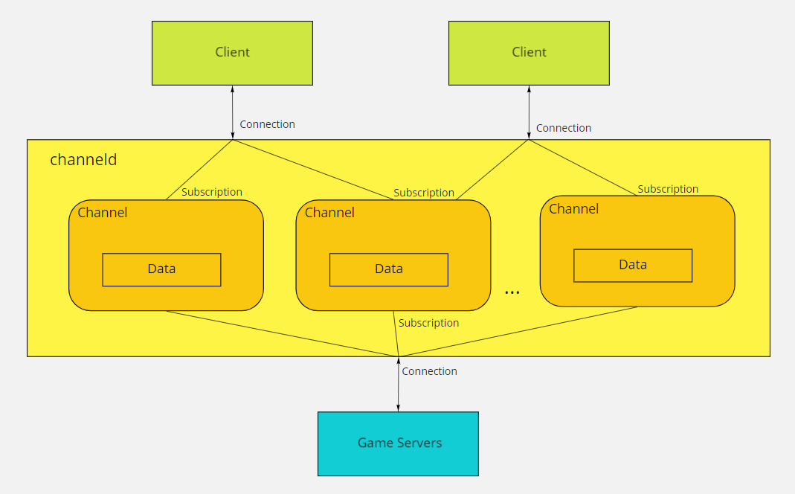
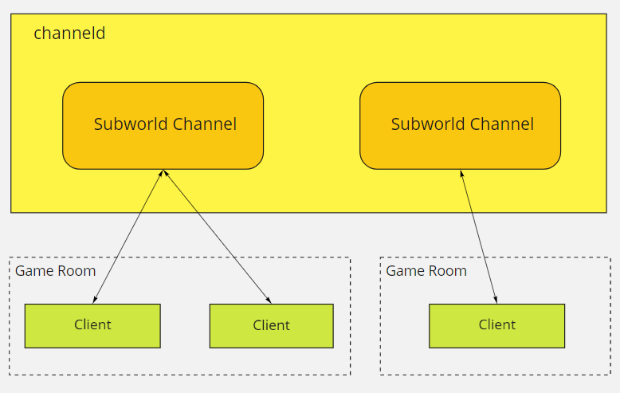
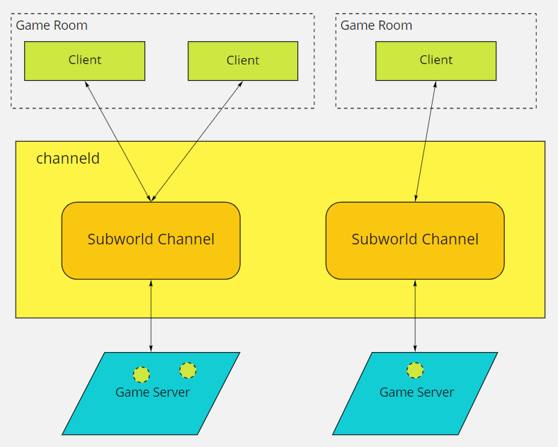
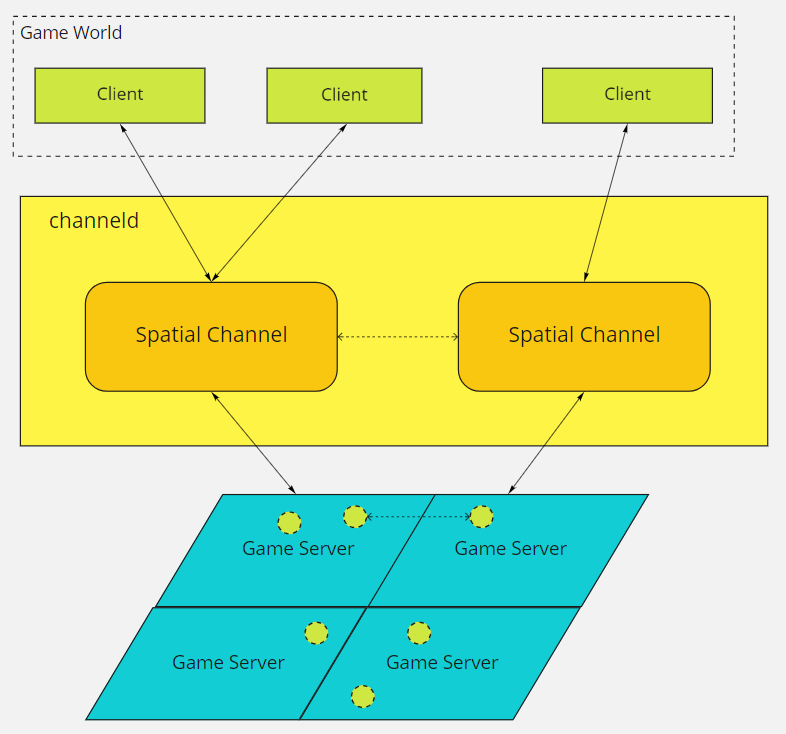

# Overview
channeld is an open source, light-weight and efficient **messaging gateway** server designed for **distributed game servers** (typically MMO) 
and other backend applications that require real-time, subscription-based user interaction with high concurrency (e.g. instance messenger server).

See the concepts in the [design doc](doc/design.md).

## Applications:
There are three major types of application benifit from channeld's architecture design:
### Relay Servers:

channeld can be used as the relay server to forward/broadcast messages between game clients.

### Dedicated Server Gateway:

channeld can be used as the gateway server to route messages to different dedicated servers.

### Seamless Distributed Server:

The ultimate purpose of channeld is to enable distributed composition of dedicated servers, together to form a seamless large virtual world.

## Key features:
* Protobuf-based binary protocol over TCP, KCP or WebSocket
* FSM-based message filtering
* Fanout-based data pub/sub of any type defined with Protobuf
* Area of interest management based on channel and data pub/sub
* [WIP] Backend servers load-balancing with auto-scaling
* [WIP] Integration with the mainstream game engines (Unity, Unreal Engine)

## Performance
channeld is aimmed to support 10Ks connections and 100Ks pps(packets per second) on a single node (uplink + downlink), and 10Ms pps in a distributed system.

## Roadmap
Currently, the completeness of the project is 20%.

There is a [dedicated roadmap documentation](doc/roadmap.md).

Keep in mind that the requirements of the real-life projects will decide the priority of the development.

# Getting Started
## 1. Clone the source code
## 2. Docker
The fastest way to run the server is with [Docker Compose](https://docs.docker.com/compose/).

There's a [docker-compose file](docker-compose.yml) set up for running the chat rooms demo. Navigate to the root of the repo and run the command:

`docker-compose up -d`
## 3. The chat rooms demo
After starting the server, browse to http://localhost:8080.

Use the input box at the bottom to send messages, to the GLOBAL channel by default. The input box can also be used to send commands, which are started with '/'. The supported commands are:

* `list [typeFilter] [metadataFilter1],[metadataFilter2],...` // the result format is `Channel(<ChannelTypeName> <ChannelId>)`
* `create <channelType> <metadata>` // the channelType is an integer. See the ChannelType enum value defined in [the proto](proto/channeld.proto) file
* `remove <channelId>` // only the channel creator has the permission to remove the channel.
* `sub <channelId>` // subscribe to the channel
* `unsub <channelId>` // unsubscribe from the channel
* `switch <channelId>` // switch the active channel. Only the active channel displays the new chat messages.

